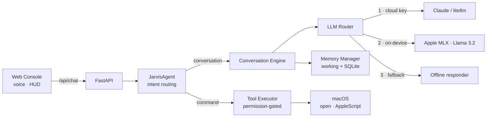

<div align="center">

# JARVIS OS

**A local-first, voice-controlled AI desktop assistant for macOS.**

Runs a real language model **entirely on your machine** — no API key, no cloud, no cost — and can see, hear, and act on your desktop.


-000000?logo=apple)


</div>

---

## What it is

JARVIS OS is an AI assistant you talk to in your browser. You speak; it transcribes, reasons, replies out loud, and — when you ask it to — **acts on your Mac**: opens apps and folders, searches the web, controls media and volume, takes screenshots, reads files, and more.

Its defining trait is that it is **local-first**. The reasoning runs on a language model executing on-device via Apple's MLX framework, so it works with **no API key and no internet** for inference. When a cloud key *is* available it uses it; when it isn't, it gracefully falls back to the local model, then to deterministic responses — the assistant never simply stops working.

> A personal engineering project exploring on-device AI, clean architecture, and secure desktop automation. Not affiliated with Marvel.

---

## Why it's interesting (the engineering)

- **Provider-agnostic reasoning with graceful degradation.** A single `LLMRouter` hides every backend behind one interface and degrades cleanly: **cloud → on-device → offline**. No component is coupled to a specific AI provider.
- **Real voice with zero native dependencies.** Rather than ship a heavy Whisper/Qt stack, the web console uses **browser-native Web Speech (STT + TTS)** and **Web Audio** (for two-clap wake) — so it runs on an 8 GB laptop with nothing extra to install.
- **Natural language → real actions, safely.** Spoken commands route to **permission-gated tools**; risky actions pass through a `PermissionManager` with typed risk levels and an audit trail.
- **Event-driven, testable core.** An async `EventBus`, a `ServiceRegistry` DI container, and a `LifecycleManager` keep modules decoupled and independently testable. **90 tests** cover the critical paths.

---

## Features

**Working today**
- 🧠 On-device LLM (Llama 3.2 via MLX) with cloud/offline fallback — no API key required
- 🎙️ Browser voice: speak to it, it speaks back; **two-clap wake**
- 💻 macOS control: open apps / folders / websites, set volume, control music, lock screen, take screenshots, type text, run AppleScript
- 🔎 Keyless web search (DuckDuckGo → Wikipedia)
- 🗂️ File tools (list / read) with credential-directory guards
- 💾 Persistent memory (working + SQLite episodic) that recalls across turns
- 🖥️ Arc-reactor HUD web console (FastAPI) with a live audio-reactive visualizer

**Roadmap**
- 🔊 Native always-on wake word + streaming STT (sherpa-onnx / RealtimeSTT)
- 🧩 Semantic long-term memory (LanceDB vector store — scaffolded)
- 🤖 LLM-driven autonomous tool calling for multi-step tasks
- 🪟 Native desktop UI (PySide6) and menu-bar presence
- 🧠 Larger local models & hot-swapping

---

## Architecture



The system is wired through an async **EventBus** and a **ServiceRegistry** (dependency injection), started in dependency order by a **LifecycleManager** — so subsystems stay decoupled and swappable.

See [`docs/`](docs/) for the deeper design write-ups.

---

## Tech stack

| Layer | Choice |
|---|---|
| Language | Python 3.12, async-first, fully type-hinted |
| On-device LLM | Apple **MLX** (`mlx-lm`) |
| LLM routing | `litellm` (cloud) + local MLX + offline |
| Memory | `aiosqlite` (episodic) · in-process working memory |
| Web backend | **FastAPI** + `uvicorn` |
| Voice / UI | Browser Web Speech & Web Audio APIs + a hand-built HUD |
| Desktop control | macOS `open` + AppleScript (`osascript`) |
| Tooling | `uv`, `ruff`, `pytest` |

---

## Quick start (macOS, Apple Silicon)

```bash
# 1. Get uv (a fast Python toolchain) if you don't have it
curl -LsSf https://astral.sh/uv/install.sh | sh

# 2. Set up the environment
cd jarvis-os
uv venv .venv --python 3.12
uv pip install --python .venv/bin/python \
  fastapi "uvicorn[standard]" mlx-lm litellm aiosqlite \
  pydantic pydantic-settings python-dotenv loguru tenacity httpx psutil typer rich

# 3. Launch the console
PYTHONPATH=src .venv/bin/python -m jarvis.cli console
```

Then open **http://127.0.0.1:8765**, click **Initialize**, allow the microphone, and start talking.
The first message downloads the local model (~0.7 GB) once; after that it runs fully offline.

*Optional — smarter cloud brain:* put `ANTHROPIC_API_KEY=...` in `.env` and it auto-prefers Claude.

---

## Usage

Say (or type) things like:

```
what time is it
open my Downloads
launch Spotify   ·   open apple.com   ·   pause the music
set the volume to 30
take a screenshot   ·   lock my screen
search for the James Webb telescope
what did I say earlier?
```

Everything above runs locally, with no API key.

---

## Project layout

```
jarvis-os/
├── src/jarvis/
│   ├── core/          # EventBus, ServiceRegistry (DI), LifecycleManager
│   ├── ai/            # LLM router, conversation engine, agent, tools
│   ├── memory/        # working + SQLite episodic memory
│   ├── integrations/  # web search, macOS desktop control
│   ├── web/           # FastAPI backend + arc-reactor HUD
│   ├── security/      # permissions, audit log, credential store
│   └── config/        # Pydantic settings
├── tests/             # 90 unit/integration tests
├── docs/              # architecture & design docs
└── scripts/           # smoke test, boot check, setup
```

---

## Testing

```bash
PYTHONPATH=src .venv/bin/python -m pytest tests/     # 90 passing
.venv/bin/ruff check src/                            # lint
.venv/bin/python scripts/smoke_test.py               # end-to-end boot + one turn
```

---

## License

[MIT](LICENSE) © 2026 Shreyas Bhardwaj
